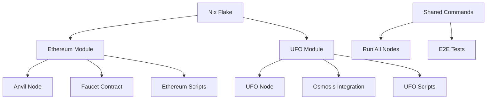
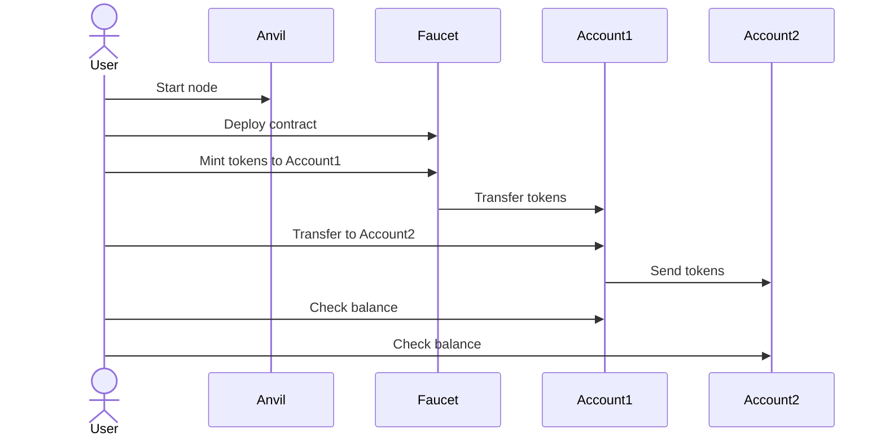
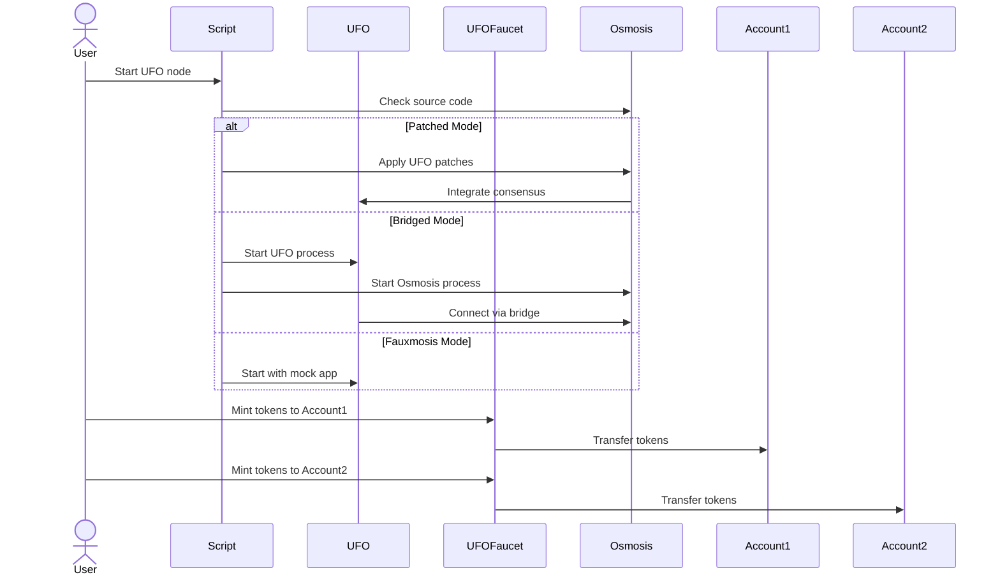
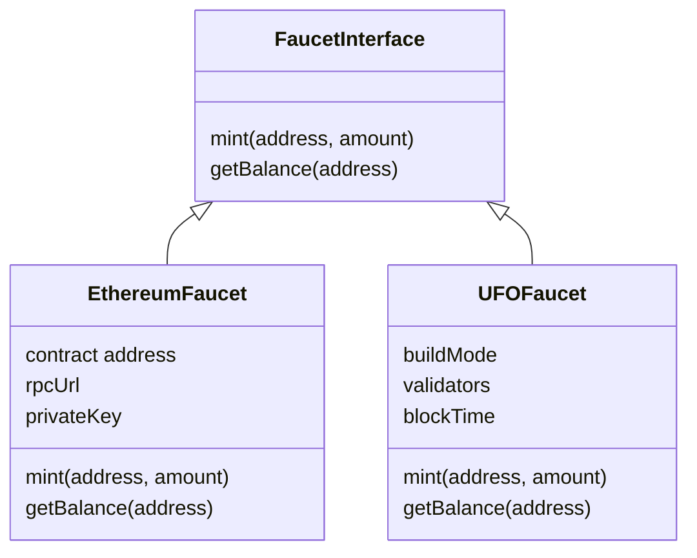

# System Architecture

This document describes the overall architecture of the integrated Ethereum and UFO node system.

## Overview

The system consists of two main components:
1. An Ethereum node with a faucet contract for token management
2. A UFO (Universal Fast Orderer) node for Cosmos SDK chain consensus with its own faucet

These components are packaged together in a Nix flake that provides a unified interface for development, testing, and operation. Both faucets share a similar API for consistency.

## Component Architecture



## Flow Diagrams

### Ethereum Node Workflow



### UFO Node Workflow



## Faucet Architecture



## Module Structure

```mermaid
classDiagram
    class FlakeOutputs {
        packages
        apps
        devShells
    }
    
    class EthereumModule {
        rpcUrl: string
        privateKey: string
        start-anvil()
        deploy-contract()
        mint-tokens()
        e2e-test()
    }
    
    class UFOModule {
        osmosisSource: string
        buildMode: enum
        validators: number
        blockTimes: number[]
        faucet: {
            enabled: boolean
            initialSupply: number
            tokenName: string
            tokenSymbol: string
        }
        run-ufo-node()
        ufo-mint-tokens()
        build-osmosis-ufo()
        benchmark-ufo()
        ufo-e2e-test()
    }
    
    FlakeOutputs --> EthereumModule
    FlakeOutputs --> UFOModule
```

## Configuration Management

Configuration for both modules is defined in the main `flake.nix` file. The Ethereum module configuration includes RPC URL and private key information, while the UFO module configuration includes the path to the Osmosis source code, the build mode, the number of validators, the block times for benchmarking, and faucet settings.

Example configuration:

```nix
# Ethereum configuration
ethereum = {
  rpcUrl = "http://localhost:8545";
  privateKey = "0xac0974bec39a17e36ba4a6b4d238ff944bacb478cbed5efcae784d7bf4f2ff80";
};

# UFO configuration
ufo = {
  osmosisSource = "/tmp/osmosis-source";
  buildMode = "patched";
  validators = 1;
  blockTimes = [ 1000 100 10 1 ];
  faucet = {
    enabled = true;
    initialSupply = 1000000;
    tokenName = "UFO";
    tokenSymbol = "UFO";
  };
};
```

## Integration Points

The main integration point between the Ethereum and UFO components is the `run-all-nodes` command, which starts both nodes and manages their lifecycle. This allows developers to work with both systems simultaneously.

Both faucets share a similar API, allowing for consistent token management across both chains:

```bash
# Ethereum faucet
nix run .#mint-tokens 0xAddress 100

# UFO faucet
nix run .#ufo-mint-tokens osmo1address 100
```

## Future Considerations

Potential future enhancements:
- Cross-chain communication between Ethereum and Cosmos
- Shared token standards
- Unified monitoring and logging
- State synchronization between chains 